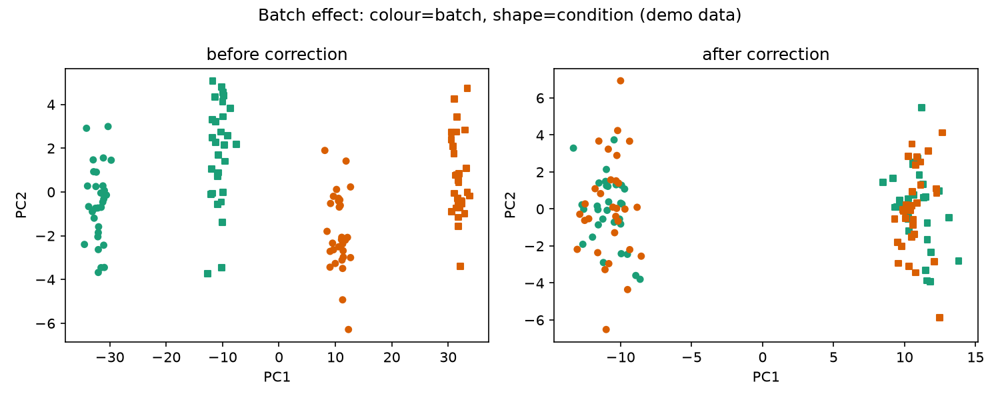

# Batch Effect Visualizer

Your samples cluster beautifully — by the day you ran them, not by biology. Batch effects are the silent killer of omics studies, and PCA is how you catch them red-handed.

## Why This Matters

If technical batch explains more variance than your biological condition, your 'top gene' might just be the one most sensitive to which day it was processed. The check is simple: PCA before and after correction. Real biology should survive the correction; the batch signal should disappear.

## How It Works

1. PCA the raw data, colouring by batch and shaping by condition.
2. Apply a batch correction.
3. PCA again and compare the two.

## What the Demo Shows



The demo layers a strong batch effect over a genuine condition difference. Before correction the points split by batch (colour); after correction they split by condition (shape) — exactly the outcome you are aiming for.

## Run It

```bash
pip install -r requirements.txt
python demo.py
```

> Demonstrated on synthetic data, so the whole thing is reproducible with no external downloads.
